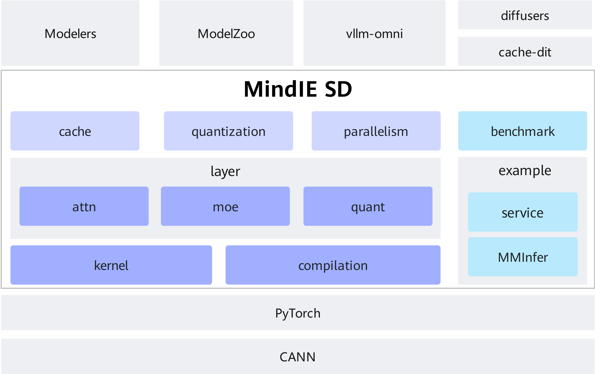

# Architecture Design

## Objectives

MindIE SD aims to build Ascend affinity multimodal acceleration suites and work with industry model suites (such as diffusers) to improve the efficiency of multimodal inference on Ascend. It focuses on providing key operators and fused operators for multimodal generation, and works with Ascend affinity quantization and sparsity algorithms to implement fast migration and Ascend acceleration of diffusers using policies such as storage instead of computing and multi-device parallelism. In the future, it will be further extended to multimodal understanding and all-modal acceleration.

The modules are decoupled and can be used independently or together. There are acceleration methods such as Cache-dit and xDiT in the industry. The effect of these methods is similar to that of the cache and parallelism modules. Therefore, solution selection is required. However, other components in MindIE SD can still be used together with these methods.

**Main features:**

- Ascend affinity acceleration operators: Provides multimodal FA, MM, MoE, and quantization operators, along with fused operators, all accessible via layer modules. For details, see [Core Acceleration APIs](./features/core_layers.md).
- Quantization and sparsity: Delivers optimized algorithm suites tailored to Ascend's data types and compute characteristics, importable via the quantization module. For details, see [Sparsity](./features/sparse.md) and [Quantization](./features/quantization.md).
- DiTCache: Offers DiT module, DiT block, and attention-level cache algorithms to accelerate diverse view scenarios. For details, see [DiTCache](./features/cache.md), [CPU Offload](./features/cpu_offload.md), and [Graphics Memory Sharing](./features/share_memory.md).
- Multi-card parallelism: Supports CFG, USP, and dynamic expert load balancing (DyEPLB) for MoE, integrated into acceleration operator APIs for automatic enablement upon interface replacement. For details, see [Multi-Card Parallelism](./features/parallelism.md) and [DyEPLB](./features/DyEPLB.md).
- Automatic affinity acceleration: Leverages `torch.compile`'s inductor mechanism with custom fusion passes to enable seamless replacement with Ascend affinity operators.

>[!NOTE]NOTE
>
>- MindIE SD-based, Ascend-accelerated diffusers models are released on [Modelers](https://modelers.cn/models?name=MindIE&page=1&size=16) and [ModelZoo](https://www.hiascend.com/software/modelzoo).
>For related features not covered in this repository, refer to the `examples` directory. For example, see the [serving](../../examples/service) example for serving deployment, and [Cache](../../examples/cache) for multimodal inference acceleration.

## Architecture

As shown in the following figure, MindIE SD provides Ascend acceleration capabilities based on the PyTorch framework. Each capability can be used independently, with core modules including cache, parallelism, quantization, layer, and kernel.

MindIE SD follows the interface definitions of diffusers. Some diffusers models accelerated on Ascend devices via MindIE SD are released under [Modelers](https://modelers.cn/models?name=MindIE&page=1&size=16)/[ModelZoo](https://www.hiascend.com/software/modelzoo). Alternatively, you can directly extend diffusers with simple plugins.



**Basic features**

- Layer module: Provides basic external acceleration APIs (including layers of features such as ATTN, MOE, and quant). It is the basis of advanced features and can be used independently.
- Kernel module: Provides a high-performance Ascend kernel related to multimodal generation and supports operator access of programming languages such as AscendC and Triton.
- Compilation module: Enables the fusion pass after the compile function is enabled based on the fx graph capability to implement Ascend automatic affinity acceleration. For details, see [Compilation](./features/compilation.md).

**Advanced features**

- Quantization module: Supports automatic enabling of the quantization capability.
- Cache module: Provides the acceleration capability of storage instead of computing.
- Parallelism module: Provides the multi-device parallel distributed acceleration capability, which needs to be implemented together with the layer module and PyTorch.

## Directory Structure

```text
|- benchmarks         // Provides performance monitoring for core kernels and acceleration effect monitoring for compilation
|- build              // Compilation scripts
|- csrc               // Ascend kernel code location
|- docs               // Project documentation
|- examples
  |- cache            // Cache feature example: enabling cache for model acceleration
  |- service          // Serving example: transforming command-line mode into a serving approach
  |- wan              // Model inference example: model inference commands and parameter configuration
|- mindiesd
  |- cache_agent      // Advanced feature: providing cache capability
  |- compilation      // Provides compilation capabilities and implements automatic graph modification based on fx graph (while maintaining single-operator dispatch).
  |- eplb             // Advanced feature: provides expert-parallel load balancing
  |- layers           // Provides basic PyTorch layer interfaces
  |- quantization     // Advanced feature: provides quantization capabilities
  |- utils            // Core tool modules that provide shared infrastructure services and common functions
|- tests              // Test cases
```
