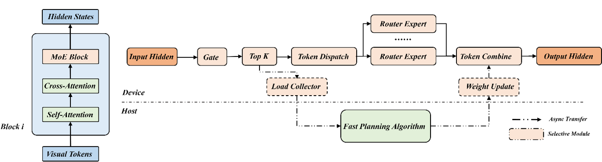

# Dynamic Expert Load Balancing

<!-- md-trans-meta sourceCommit=unknown translatedAt=2026-06-05T08:14:58.282Z pushedAt=2026-06-08T06:48:52.634Z -->

## General Principles

As vision generation models evolve toward the DiT architecture, integrating MoE to further scale has become an industry consensus. However, the massive parameter size of DiT-MoE necessitates expert parallelism (EP). Unlike LLMs, visual data exhibits strong spatial locality, which often leads to overload on specific experts and severe computational imbalances. Moreover, the denoising process of diffusion models introduces significant temporal dynamics in expert activation patterns. This means traditional static load balancing strategies are completely inadequate for such spatiotemporal heterogeneity.



## Technical Features

This solution dynamically adjusts expert weights on Ranks based on load information to balance expert load and accelerate model inference. The solution has the following features:

- **Non-intrusive design**: Global synchronization points and weight update locations can be chosen based on the model implementation.

- **Asynchronous pipelining**: Algorithm computation and expert weight concatenation are handled by separate threads and processes, minimizing the impact on the main inference flow.

- **Three EP modes**:  standard all-to-all (A2A), all-gather (AG), and controllable mode (EX), selectable via the `mode` parameter.

- **Mutual exclusion reminder with CPU Offload**: Involves H2D data transfer. When used concurrently with [CPU Offload](cpu_offload.md), bandwidth contention may occur, requiring manual adjustment of execution timing.

## Interface and Usage

### Recommended Solutions

- **A2A**: EP with balanced communication, recommended for general scenarios.

- **AG**: EP that requires an additional matmul of the transformation matrix and expert scores, suitable for scenarios requiring global synchronization.

- **EX**: Controllable mode that limits the scale of expert layout changes via `max_move`, suitable for reducing peak memory when offload exists.

### Adaptation Process

> **NOTE**
> To minimize the impact on the main inference process, the algorithm and expert weight concatenation are handled using additional threads and processes.

1. Start the EPLB algorithm process. The startup parameters are as follows:

   | Parameter | Default Value | Description |
   |------|--------|------|
   | `world_size` | Required | Number of EPs |
   | `expert_num` | Required | Number of global experts |
   | `block_num` | Required | Number of MoE layers |
   | `max_move` | — | Maximum number of experts to move in EX mode |
   | `redundant` | — | Number of redundant experts |
   | `mode` | Required | A2A / AG / EX |
   | `auth_key` | `secret_key` | Reads the environment variable `EPLB_AUTH_KEY` by default |

   ```shell
   python -m mindiesd.eplb.eplb_scheduler \
       --world_size 2 \
       --host localhost \
       --port 50001 \
       --mode A2A
   ```

2. Import the load collector and dispatcher, initialize them, and then start the worker thread.

   ```python
   from mindiesd.eplb.dispatcher import DynamicDispatcher
   from mindiesd.eplb.collector import ExpertLoadCollector
   from mindiesd.eplb.task_manager import construct_expert_info_transfer_pool

   model.init()

   model.moe_module.block.expert_load_collector = ExpertLoadCollector(expert_num, lb_interval)
   model.moe_module.block.dispatcher = DynamicDispatcher(expert_num, weight1, weight2, rank_in_group, ep_size)

   if eplb_enabled:
       construct_expert_info_transfer_pool(
           module=model, rank_in_group=rank_in_group, device=device,
           ip=host, port=port, auth_key=auth_key
       )

   model.forward()
   ```

3. In AG mode, an additional transformation matrix multiplication is required.

   ```python
   if EP_AG and self.dispatcher.update_flag:
       expert_trans_tensor = self.dispatcher.get_expert_trans_tensor()
       trans_scores = torch.matmul(scores, expert_trans_tensor)
   ```

4. Insert load collection and weight replacement after `npu_moe_init_routing` and before `npu_grouped_matmul_finalize_routing` in the MoE forward pass.

   ```python
   expanded_tokens, expanded_row_idx, expanded_indices = torch_npu.npu_moe_init_routing(
       tokens, row_idx, indices, tokens.shape[0])

   self.expert_load_collector.collect_expert_load(expanded_indices)
   self.dispatcher.check_consistency()

   if self.dispatcher.update_flag:
       weight1, weight2, local_expert_num, device_indices_map, \
           local_expert_indices_map, local_expert_list = \
           self.dispatcher.update_module_weight_and_map()
       self.weight1 = weight1
       self.weight2 = weight2
       self.local_expert_num = local_expert_num

   tokens = torch_npu.npu_grouped_matmul_finalize_routing()
    ```

### Class Description

#### ExpertLoadCollector

```python
from mindiesd.eplb.collector import ExpertLoadCollector
```

| Parameter | Type | Mandatory | Default Value | Description |
|------|------|------|--------|------|
| `expert_num` | `int` | Yes | - | Number of global experts |
| `lb_interval` | `int` | No | `1` | EPLB interval steps |

#### DynamicDispatcher

```python
from mindiesd.eplb.dispatcher import DynamicDispatcher
```

| Attribute Name | Type | Mandatory | Default Value | Description |
|------|------|------|--------|------|
| `expert_num` | `int` | Yes | - | Number of global experts |
| `weight1` | `Tensor` | Yes | - | UP weight |
| `weight2` | `Tensor` | Yes | - | DOWN weight |
| `rank_in_group` | `int` | Yes | - | Rank within the EP communication group |
| `ep_size` | `int` | Yes | - | EP size |

#### construct_expert_info_transfer_pool

```python
from mindiesd.eplb.task_manager import construct_expert_info_transfer_pool
```

| Attribute Name | Type | Mandatory | Default Value | Description |
|------|------|------|--------|------|
| `module` | `Module` | Yes | - | Initialized model |
| `rank_in_group` | `int` | Yes | - | Rank within the EP communication group |
| `device` | `int` | Yes | - | Device ID corresponding to the rank |
| `ip` | `str` | Yes | - | Must match the server IP |
| `port` | `int` | Yes | - | Must match the server port |
| `auth_key` | `str` | No | `secret_key` | Reads the environment variable `EPLB_AUTH_KEY` by default |
