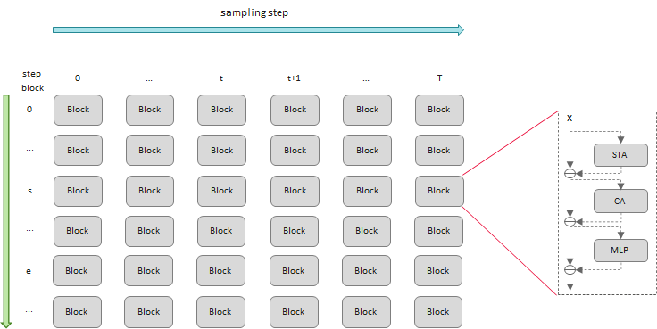
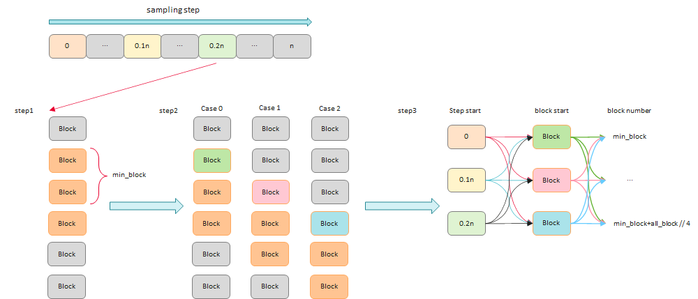
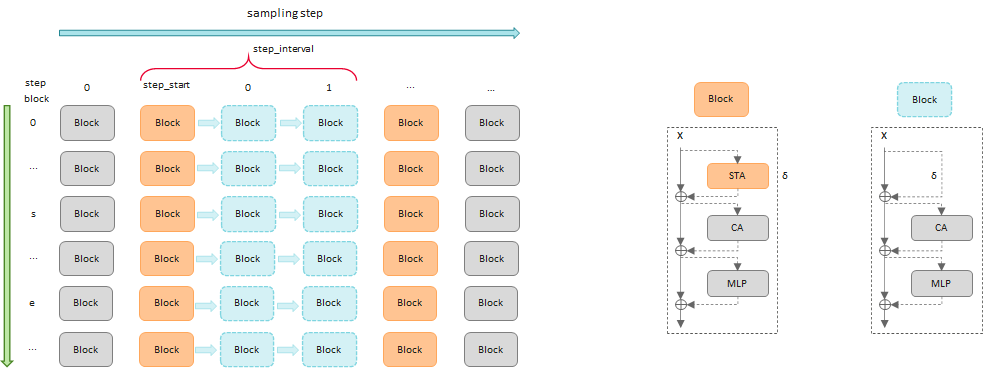
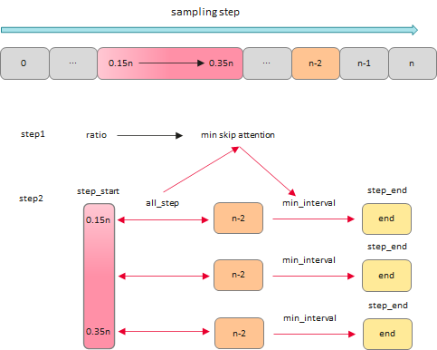

# Compute by Caching

Diffusion models iterate over multiple timesteps during inference. All blocks participate in computation within each timestep, and the similarity of latents between adjacent steps leads to significant redundant computation. MindIE SD provides the following caching acceleration methods to reduce redundant computation:

- **DiTCache**: Caches and reuses intermediate results at the block granularity, suitable for models with many blocks.
- **AttentionCache**: Caches and reuses attention computation results at the Attention layer granularity, suitable for models where attention computation accounts for a large proportion.
- **Timestep Optimization**: Reduces or skips some timesteps during the diffusion process, suitable for scenarios requiring fine-grained control over inference steps.

Each caching strategy can be used independently, or the most suitable combination can be selected based on model characteristics.

- **DiTCache First**: Block-granularity caching with the strongest generality. Recommended to try first.
- **AttentionCache Alternative**: Suitable for models with a high proportion of attention computation. Finer granularity than DiTCache.
- **Timestep Optimization Supplement**: Complements other caching strategies. Can further reduce the number of steps on top of DiTCache or AttentionCache.

## Interface Description

### CacheConfig

Cache configuration class that defines parameters such as the caching method, number of blocks, and number of steps.

```python
from mindiesd import CacheConfig
```

| Parameter | Type | Required | Default | Description |
|------|------|------|--------|------|
| `method` | `str` | Yes | - | Caching method, `"attention_cache"` or `"dit_block_cache"` |
| `blocks_count` | `int` | Yes | - | Number of blocks per step |
| `steps_count` | `int` | Yes | - | Total number of iteration steps |
| `step_start` | `int` | No | `0` | Step index to start caching |
| `step_interval` | `int` | No | `1` | Caching interval in steps |
| `step_end` | `int` | No | `10000` | Step index to end caching |
| `block_start` | `int` | No | `0` | Block index to start caching |
| `block_end` | `int` | No | `10000` | Block index to end caching |

### CacheAgent

Cache agent class that manages cache application based on configuration.

```python
from mindiesd import CacheAgent
```

**Constructor Parameters**:

| Parameter | Type | Required | Default | Description |
|------|------|------|--------|------|
| `config` | `CacheConfig` | Yes | - | Cache configuration object |

**apply Method**:

```python
apply(function: callable, *args, **kwargs) -> Any
```

| Parameter | Type | Required | Description |
|------|------|------|------|
| `function` | `callable` | Yes | The function to execute (block or attention module) |
| `*args` | - | No | Positional arguments for the function |
| `**kwargs` | - | No | Keyword arguments for the function |

---

## DiTCache

- **Background**

  During inference, the DiT model iterates over T steps. Each step t fully computes all blocks, and each block contains numerous computation operations (as shown in the figure below). However, the latents between adjacent steps are very similar, causing nearly identical intermediate results to be computed repeatedly during inference, resulting in computational redundancy and slow inference speed.

  

<br>

- **Principle**

  Based on the activation similarity between adjacent iteration steps or between adjacent blocks, local model features are reused, specified DiTBlocks are skipped, redundant computation is reduced, and model inference is accelerated.

<br>

- **Optimization Method**

  Using a search script, the minimum number of blocks to skip is calculated based on the speedup ratio. Then, starting from the start/end blocks, all possible combinations are traversed to find the configuration with the minimum MSE loss as the optimal solution. The core optimization is: when a cache hit occurs, the computation results of a specific block range in stepN are directly reused in stepM, turning the entire forward propagation computation of the DiTBlock sequence into a simple tensor read operation.

    
  1. Calculate the minimum number of blocks to cache based on the speedup ratio.
  2. In each step, since block0 needs to be computed, traversal starts from block1, and the three smallest groups of block start and block end are found through calculation.
  3. Traverse all possible combinations obtained in the previous step, calculate the MSE before and after caching, and find the configuration with the minimum MSE loss as the optimal solution.
  4. Configure the parameters obtained from the above steps into the model, and enable caching during inference to complete the acceleration.

<br>

- **Optimization Procedure**
  1. Call the CacheConfig and CacheAgent interfaces.

      ```python
      from mindiesd import CacheConfig, CacheAgent
      ```

  2. Initialize CacheConfig in the model's initialization method.

      ```python
      config = CacheConfig(
              method="dit_block_cache",
              blocks_count=len(transformer.single_blocks), # Number of blocks with caching enabled
              steps_count=args.infer_steps,                # Total number of inference iteration steps
              step_start=args.cache_start_steps,           # Step index to start caching
              step_interval=args.cache_interval,           # Interval steps for forced recomputation
              step_end=args.infer_steps-1,                 # Step index to stop caching
              block_start=args.single_block_start,         # Block index to start caching in each step
              block_end=args.single_block_end              # Block index to stop caching in each step
          )
      ```

  3. Initialize the cache variable in the Transformer's init method.

      ```python
      self.cache = None
      ```

  4. Initialize CacheAgent and assign it to the block.

      ```python
      cache_agent = CacheAgent(config)
      # Enable ditcache
      pipeline.transformer.cache = CacheAgent(config)
      ```

  5. In the Transformer's forward method, use the apply method to enable caching for inference. The first argument of the apply method is the block, and the remaining arguments are consistent with the original code.

      ```python
      for index_block, block in enumerate(self.transformer_blocks):
        # Enable ditcache
        hidden_states, encoder_hidden_states = self.cache.apply(
            block,
            hidden_states=hidden_states,
            encoder_hidden_states=encoder_hidden_states,
            encoder_hidden_states_mask=encoder_hidden_states_mask,
            temb=temb,
            image_rotary_emb=image_rotary_emb,
            joint_attention_kwargs=attention_kwargs,
            txt_pad_len=txt_pad_len
        )
      ```

<br>

- **Example**

  For detailed examples, please refer to the [cache directory](../../../examples/cache/cache.py) under examples.

---

## AttentionCache

- **Background**

  During inference, the model iterates over T steps. Each step contains multiple blocks, and each block contains numerous computation operations, such as STA (as shown in the figure below). However, the attention layers within blocks between adjacent steps are quite similar, causing nearly identical intermediate results to be computed repeatedly during inference, resulting in computational redundancy and slow inference speed.

  

<br>

- **Principle**

  Based on the feature similarity between adjacent timesteps, unlike DiTCache, AttentionCache reuses attention computation results within blocks, thereby skipping some attention layers, reducing redundant computation, and accelerating model inference.

<br>

- **Optimization Method**

  Using a search script, the minimum number of attention operations to skip is calculated based on the speedup ratio. Then, the start and end steps are traversed, and among all possible combinations, the configuration with the minimum MSE loss is found as the optimal solution. The core optimization is: using the principle of trading space for time, the cached computation results of attention layers of blocks in stepN are directly reused in stepM, significantly reducing the computation workload of attention layers.

    
  1. Based on the speedup ratio, calculate the minimum number of attention operations to skip.
  2. Calculate min_interval and step_end based on the start step and min_skip_attention, traverse all possible results, calculate the MSE before and after caching, and find the configuration with the minimum MSE loss as the optimal solution.
  3. Configure the parameters obtained from the above steps into the model, and enable caching during inference to complete the acceleration.

<br>

- **Optimization Procedure**

  1. Call the CacheConfig and CacheAgent interfaces.

      ```python
      from mindiesd import CacheConfig, CacheAgent
      ```

  2. Initialize CacheConfig. For attention_cache, block_start and block_end can use default values.

      ```python
      config = CacheConfig(
                  method="attention_cache",
                  blocks_count=len(transformer.transformer_blocks), # Number of blocks contained in the transformer model
                  steps_count=args.infer_steps,                # Total number of inference iteration steps
                  step_start=args.start_step,                  # Step index to start caching
                  step_interval=args.attentioncache_interval,  # Interval steps for forced recomputation
                  step_end=args.end_step                       # Step index to stop caching
              )
      ```

  3. Initialize the cache variable in the init method of the Transformer's block module.

      ```python
      self.cache = None
      ```

  4. Initialize CacheAgent and assign it to the block.

      ```python
      cache_agent = CacheAgent(config)
      # Cache the attention part within the block
      for block in transformer.transformer_blocks:
          block.cache = cache_agent
      ```

  5. In the forward method of the Transformer's block module, use the apply method to enable caching for inference. The first argument of the method is the original inference function, and the remaining arguments are consistent with the original code.

      ```python
      # Enable attention cache
      attn_output = self.cache.apply(
          self.attn,
          hidden_states=img_modulated,
          encoder_hidden_states=txt_modulated,
          encoder_hidden_states_mask=encoder_hidden_states_mask,
          image_rotary_emb=image_rotary_emb,
          **joint_attention_kwargs,
      )
      ```

- **FAQ**

  Q: Qwen-Image-Edit-2509 reports an error during inference after enabling AttentionCache: RuntimeError: NPU out of memory.

  A: Enabling AttentionCache increases memory consumption. Single-card memory is prone to insufficiency. Using eight-card inference is recommended.

---

## Timestep Optimization

- **Principle**

  By reducing, adjusting, or skipping certain steps in the denoising process of the diffusion model, the number of DiTModules is reduced while minimizing precision loss, avoiding redundant computation, and accelerating model inference.

<br>

- **Optimization Method**

  <ul>
      <li>Modify the timestep value: for example, reducing from 50 to 20 to improve inference speed.</li>
      <li>Adastep sampling: An adaptive, dynamic timestep skipping algorithm. Its core idea: evaluate the current state of the latent in real-time during inference, dynamically deciding to skip several steps with small inter-step differences, to achieve fast convergence. Currently, this method is only used in CogVideoX; other models do not use it, replaced by DiTCache and AttentionCache.</li>
  </ul>
