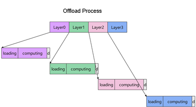
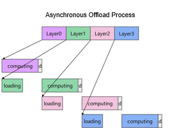

# CPU Offload

<!-- md-trans-meta sourceCommit=unknown translatedAt=2026-06-05T08:14:47.293Z pushedAt=2026-06-08T06:31:14.106Z -->

## General Principles

During DiT model inference, the weights of all layers (blocks) must remain in NPU memory. When the model exceeds the memory capacity of a single device, offload is used: temporarily moving some block weights to CPU memory, then loading them back to NPU when those blocks are computed.

In synchronous offload mode, the GPU pauses after completing a layer to wait for the next layer's weights to be transferred from the CPU to the NPU. This results in significant GPU idle time and reduced utilization.

## Technical Features

This repository addresses synchronous mode inefficiencies using an asynchronous offload approach.

Its core principle is an asynchronous pipeline that parallelizes computation and weight loading. While the GPU computes layer N, layer N+1's weights are already being loaded in the background. By the time layer N finishes, layer N+1's weights are ready—hiding load latency behind compute time and significantly reducing GPU idle periods.

The following figure shows a comparison of the synchronous offload and asynchronous offload processes:

 

The mechanism works as follows:

- **Independent copy streams**: `h2d_stream` (Host to Device) and `d2h_stream` (Device to Host) are separated from the compute stream, enabling copy-compute overlap.

- **Forward pre-hook**: Asynchronously loads the weights of the next block into NPU before the current block executes.

- **Forward hook**: Offloads the weights of the block from NPU after execution, freeing up device memory.

- **Reserved block count**: The `min_reserved_blocks_count` parameter controls how many blocks remained on NPU; all others are dynamically swapped in and out.

## Interface Description

```python
from mindiesd.offload import enable_offload
```

### Function Signature

```python
enable_offload(model, blocks, min_reserved_blocks_count=2)
```

### Parameter Description

| Parameter | Type | Required | Default Value | Description |
|------|------|------|--------|------|
| `model` | `torch.nn.Module` | Yes | - | The target model for which offload is to be enabled |
| `blocks` | `ModuleList` | Yes | - | A list of blocks within the model, arranged in order |
| `min_reserved_blocks_count` | `int` | No | `2` | The number of blocks remained on NPU |

### Return Value

`None`: modified in place; no value is returned.

### Usage Example

```python
from mindiesd.offload import enable_offload

# Create a model
model = DiTModel(...)

# Enable offload, retaining 2 blocks on the NPU
enable_offload(model, model.blocks, min_reserved_blocks_count=2)

# Move the model to the NPU
model.to("npu")

# Execute inference normally; the framework automatically manages asynchronous swapping of weights in and out
with torch.no_grad():
    output = model(x)
```

### Precautions

- When used concurrently with [DyEPLB.md](DyEPLB.md), bandwidth contention may occur. You need to adjust the execution timing to avoid mutual blocking.
