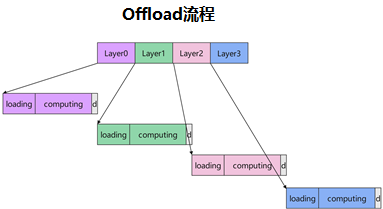
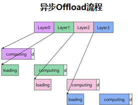

# CPU Offload

## General Principles

In DiT model inference, all block weights must reside in NPU memory. When the model size exceeds a single card's memory capacity, some block weights need to be temporarily offloaded to CPU memory and transferred back to NPU when computing those blocks. This technique is called offloading.

In synchronous offload mode, the GPU stops after computing one layer and waits for the next layer's weights to be transferred from CPU to NPU before continuing. This causes the GPU to be idle most of the time, reducing utilization.

## Technical Features

This repository adopts an **Asynchronous Offload** approach to address the efficiency problem of synchronous mode.

The core principle is: through an asynchronous pipeline design, computation and weight loading are parallelized. While the GPU computes layer N, layer N+1 weights are already being transferred in the background. When layer N computation completes, layer N+1 weights are already loaded and ready, with computation time masking transfer time, significantly reducing GPU idle time.

The following diagram compares synchronous and asynchronous offload flows:

 

Implemented through the following mechanisms:

- **Independent copy streams**: `h2d_stream` (Host to Device) and `d2h_stream` (Device to Host) are separated from the compute stream, enabling parallel copy and computation.
- **Forward pre-hook**: Before block execution, asynchronously loads subsequent block weights to NPU.
- **Forward hook**: After block execution, offloads used weights from NPU to free memory.
- **Reserved block count**: The `min_reserved_blocks_count` parameter controls the number of blocks always kept on NPU; remaining blocks are dynamically swapped in and out.

## API Reference

```python
from mindiesd.offload import enable_offload
```

### Function Signature

```python
enable_offload(model, blocks, min_reserved_blocks_count=2)
```

### Parameters

| Parameter | Type | Required | Default | Description |
| ------ | ------ | ------ | -------- | ------ |
| `model` | `torch.nn.Module` | Yes | - | Target model to enable offloading |
| `blocks` | `ModuleList` | Yes | - | Sequentially ordered block list in the model |
| `min_reserved_blocks_count` | `int` | No | `2` | Number of blocks always kept on NPU |

### Return Value

`None`: Modifies in-place, no return value.

### Usage Example

```python
from mindiesd.offload import enable_offload

# Create model
model = DiTModel(...)

# Enable offload, keep 2 blocks on NPU
enable_offload(model, model.blocks, min_reserved_blocks_count=2)

# Move model to NPU
model.to("npu")

# Normal inference; framework automatically manages async weight swapping
with torch.no_grad():
    output = model(x)
```

### Notes

- When used together with [DyEPLB.md](DyEPLB.md), bandwidth contention may occur. Adjust execution timing as needed to avoid mutual blocking.
