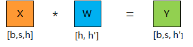
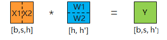
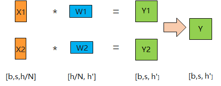
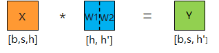
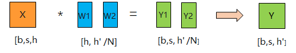
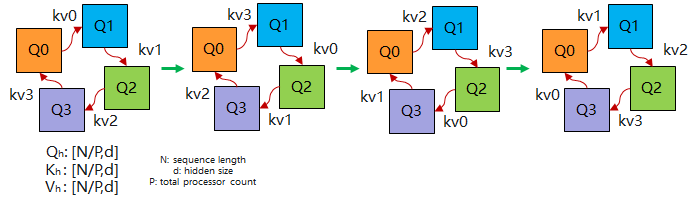
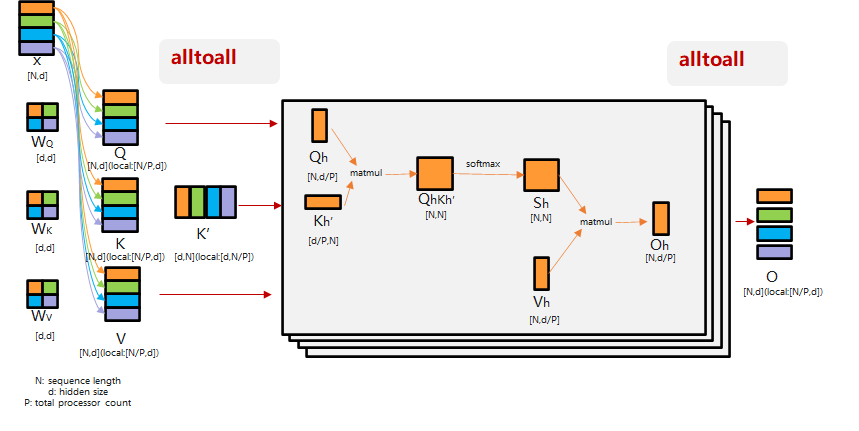
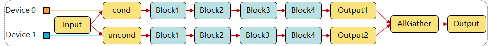
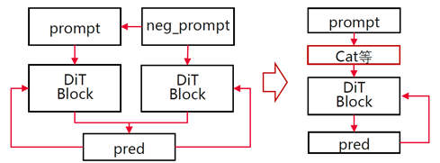

# Multi-Card Parallelism

MindIE SD provides multiple parallelism strategies to solve the problems of insufficient single-card memory and inference speed bottlenecks. Different strategies split computation and memory from different dimensions:

- **Tensor Parallel (TP)**: Splits along the rows or columns of weight matrices, distributing matrix computation across multiple cards. Suitable for models with large hidden dimensions.
- **Ring Sequence Parallel (RSP)**: Splits Q along the sequence dimension, transfers KV between devices in a ring communication pattern, hiding communication overhead through computation.
- **Ulysses Sequence Parallel (USP)**: Splits input along the sequence dimension, reorganizes across attention head dimensions via AlltoAll, and computes different attention heads in parallel on each card.
- **CFG Parallel**: Distributes positive and negative sample inference to different devices for parallel execution. Suitable for diffusion models using Classifier-Free Guidance.

Each strategy can be used independently or combined. For specific support details, please refer to [supported_matrix.md](supported_matrix.md).

**Recommendations:**

- **Tensor Parallel (TP)**: Can effectively reduce memory usage, but has significant communication overhead. Not recommended as a first choice.
- **Ulysses Sequence Parallel (USP)**: Low communication overhead. Recommended as a first choice. Constraint: USP parallelism degree must be divisible by FA's head num.
- **Ring Sequence Parallel (RSP)**: Can be used together with Ulysses to complement the part where USP cannot be divided by head num.
- **CFG Parallel**: Low communication overhead. Recommended when the model's CFG > 1.

## Tensor Parallel

As model size increases, single-card memory capacity cannot meet the demands of large models. Tensor parallelism distributes the model's tensor computations (such as matrix multiplication, convolution, etc.) across multiple devices for parallel execution, thereby reducing the memory and computation load on individual devices. This section uses a single matrix multiplication as an example to introduce the principles of tensor parallelism.

Suppose the input data is X, the parameter is W, the dimensions of X = (b, s, h), and the dimensions of W = (h, h'). A single matrix multiplication is shown in the figure below. Where:

- b: batch_size, representing the batch size.
- s: sequence_length, representing the length of the input sequence.
- h: hidden_size, representing the dimension of each token vector.
- h': hidden_size of parameter W.



There are two optimization methods:

- Row-wise splitting: Split along the rows of weight W. Taking N=2 as an example, the matrix is split along the dashed line.

    

    The figure below shows the result after splitting, converting one matrix multiplication into two, each computed on a different NPU. The complete result is obtained by adding the individual results through inter-card communication.

    

- Column-wise splitting: Split along the columns of weight W. Taking N=2 as an example, the matrix is split along the dashed line.

    

    The figure below shows the result after splitting, converting one matrix multiplication into two, each computed on a different NPU. The complete result is obtained by concatenating the individual results through inter-card communication.

    

### Code Example

The following example demonstrates the basic usage of distributed initialization and tensor parallelism:

```python
import os
import torch
import torch.distributed as dist
import torch_npu

# 1. Initialize distributed environment
dist.init_process_group(backend="hccl")
torch.npu.set_device(f"npu:{os.environ['LOCAL_RANK']}")

# 2. Define the original linear layer
linear = torch.nn.Linear(4096, 4096).npu()
x = torch.randn(1, 256, 4096, device="npu")

# 3. Column-wise split: each rank holds half the columns of W
#    Results are merged via all-reduce communication after forward pass
world_size = dist.get_world_size()
rank = dist.get_rank()

with torch.no_grad():
    # Split weight: each rank holds W[:, h//world_size * rank : h//world_size * (rank+1)]
    w_chunk = linear.weight.data.chunk(world_size, dim=0)[rank]
    # Local matrix multiplication
    local_out = x @ w_chunk.T
    # all-reduce to merge results from each rank
    dist.all_reduce(local_out)

print(f"Rank {rank} output shape: {local_out.shape}")
```

### Communication Method

For column-wise splitting, each device independently computes local matrix multiplications and then merges results via all-reduce. For row-wise splitting, each device computes a shard of the complete result and concatenates the full output via all-gather. Communication volume is proportional to hidden_size. When inter-device bandwidth is sufficient, the proportion of communication overhead decreases as the model grows larger.

### Applicable Scenarios

Suitable for models with large hidden dimensions (hidden_size). Particularly effective when single-card memory cannot accommodate the full weight matrix. TP relies on high-bandwidth inter-card communication (such as HCCS). It is recommended to use it only within a single-machine multi-card scope, and the TP degree should not exceed the number of NPUs in a single machine.

---

## Ring Sequence Parallel

### Principle

Q is split across devices. During computation, after each device computes the current KV pair, it sends its KV pair to the next device and continues to receive the KV pair from the previous device, forming a ring communication structure. When inter-card communication time ≤ computation time, the communication overhead can be hidden by computation.



### Communication Method

Uses P2P (point-to-point) communication. After device i completes the attention computation for the current step, it sends its KV to device i+1 while receiving new KV from device i-1. After N rounds of communication, all devices complete attention computation for all sequence positions. When computation time exceeds communication time (i.e., long sequences, large head_dim), communication overhead can be completely hidden by computation.

### Applicable Scenarios

Suitable for long-sequence scenarios where sequence length is much larger than head_dim. Best results when inter-device P2P bandwidth is ample (e.g., same-machine NPUs). Not suitable for short-sequence scenarios where communication overhead becomes too high a proportion.

### Usage Example

```python
import torch
import torch.distributed as dist

dist.init_process_group(backend="hccl")
rank = dist.get_rank()
world_size = dist.get_world_size()

batch, seqlen, head, dim = 1, 4096, 8, 128
seqlen_chunk = seqlen // world_size

# Each device holds its own Q/K/V shard
q_chunk = torch.randn(batch, seqlen_chunk, head, dim).npu()
k_chunk = torch.randn(batch, seqlen_chunk, head, dim).npu()
v_chunk = torch.randn(batch, seqlen_chunk, head, dim).npu()

def local_attn(q, k, v):
    score = (q @ k.transpose(-2, -1)) / (dim ** 0.5)
    return score.softmax(dim=-1) @ v

# First round: compute own KV
out = local_attn(q_chunk, k_chunk, v_chunk)

# Subsequent rounds: ring transfer of KV
for step in range(1, world_size):
    send_rank = (rank + 1) % world_size
    recv_rank = (rank - 1 + world_size) % world_size
    k_recv = torch.empty_like(k_chunk)
    v_recv = torch.empty_like(v_chunk)
    dist.send_recv(k_chunk, k_recv, send=send_rank, recv=recv_rank)
    dist.send_recv(v_chunk, v_recv, send=send_rank, recv=recv_rank)
    k_chunk, v_chunk = k_recv, v_recv
    out += local_attn(q_chunk, k_chunk, v_chunk)
```

---

## Ulysses Sequence Parallel

### Principle

Each sample is split along the sequence dimension and distributed to different devices. Before attention computation, AlltoAll is performed on the split Q, K, and V. Each device exchanges information with all other devices, and each device receives a non-overlapping subset of attention heads. Each device computes different attention heads in parallel, and after computation, the results are gathered via AlltoAll again.



### Communication Method

The core uses AlltoAll collective communication. Before attention computation, each device sends its sequence chunks to all other devices while receiving sequence chunks from other devices, completing data reorganization along the attention head dimension. After computation, results are gathered back along the sequence dimension via AlltoAll again. When sequence length and device count increase proportionally, the per-device communication volume remains constant (for theoretical analysis, see the DeepSpeed Ulysses paper).

### Applicable Scenarios

Suitable for scenarios with many attention heads and ample AlltoAll bandwidth. Compared to RSP, Ulysses is more efficient in short-sequence multi-head scenarios, especially when both sequence length and hidden_size are large.

- Example without Ulysses Sequence Parallel:

    ```python
    import torch
    import torch_npu
    from mindiesd import attention_forward
    torch.npu.set_device(0)
    batch, seqlen, hiddensize = 1, 4096, 512
    head = 8
    x = torch.randn(batch, seqlen, hiddensize, dtype=torch.float16).npu()
    x = x.reshape(batch, seqlen, head, -1)
    out = attention_forward(x, x, x, opt_mode="manual", op_type="prompt_flash_attn", layout="BSND")
    x = out.reshape(batch, seqlen, hiddensize)
    ```

- Example with Ulysses Sequence Parallel:

    ```python
    import os
    import torch
    import torch.distributed as dist
    import torch_npu
    from mindiesd import attention_forward

    batch, seqlen, hiddensize = 1, 4096, 512
    head = 8
    x = torch.randn(batch, seqlen, hiddensize, dtype=torch.float16).npu()

    def init_distributed(
        world_size: int = -1,
        rank: int = -1,
        distributed_init_method: str = "env://",
        local_rank: int = -1,
        backend: str = "hccl"
    ):
        dist.init_process_group(
            backend=backend,
            init_method=distributed_init_method,
            world_size=world_size,
            rank=rank,
        )
        torch.npu.set_device(f"npu:{os.environ['LOCAL_RANK']}")
    # 1. Initialize distributed environment
    world_size = int(os.environ["WORLD_SIZE"])
    rank = int(os.environ["LOCAL_RANK"])
    init_distributed(world_size, rank)

    # 2. Split the seqlen dimension by world_size
    x = torch.chunk(x, world_size, dim=1)[rank] # Sequence split
    seqlen_chunk = x.shape[1]
    x = x.reshape(batch, seqlen_chunk, head, -1)

    # 3. Call all_to_all to enable Ulysses parallelism
    in_list =  [t.contiguous() for t in torch.tensor_split(x, world_size, 2)]
    output_list = [torch.empty_like(in_list[0]) for _ in range(world_size)]
    dist.all_to_all(output_list, in_list)
    x = torch.cat(output_list, dim=1).contiguous()
    att_out = attention_forward(x, x, x, opt_mode="manual", op_type="prompt_flash_attn", layout="BSND")
    in_list =  [t.contiguous() for t in torch.tensor_split(att_out, world_size, 1)]
    output_list = [torch.empty_like(in_list[0]) for _ in range(world_size)]
    dist.all_to_all(output_list, in_list)
    x = torch.cat(output_list, dim=2).contiguous()
    x = x.reshape(batch, seqlen_chunk, hiddensize)

    # 4. Perform all_gather on the seqlen dimension
    output_list = [torch.empty_like(x) for _ in range(world_size)]
    dist.all_gather(output_list, x)
    x = torch.cat(output_list, dim=1)
    ```

---

## FA_Power_Cap Technology

`FA_Power_Cap` technology can use `--comm_type 0/1/2` to switch between baseline, InsertComm, and BlockAttn paths. For the step-by-step manual integration guide, see [FA_Power_Cap Technology](./fa_power_cap.md).

---

## CFG Parallel

### Principle

For a noisy image and text prompt, the model needs to perform inference twice, computing positive and negative samples separately. This computation process is serial, causing each denoising step to require two forward passes, increasing inference time. CFG parallel can distribute positive and negative sample computation to different devices, merging two serial computations into one parallel computation, significantly improving inference speed.



### Communication Method

Positive and negative sample computations are completely independent; no intermediate communication is needed between devices. After computation, the two results are gathered via all-gather, or each device can directly use its own computation result. Communication volume is minimal, approximating zero-overhead parallelism.

### Applicable Scenarios

Suitable for diffusion model inference scenarios using CFG (guidance_scale > 1), with at least 2 spare devices. The more devices, the closer the speedup approaches 2x. If devices are limited, prioritize allocating resources to TP or sequence parallelism.

### Usage Example

```python
import os
import torch
import torch.distributed as dist

dist.init_process_group(backend="hccl")
torch.npu.set_device(f"npu:{os.environ['LOCAL_RANK']}")

rank = dist.get_rank()
guidance_scale = 7.5

# rank 0 computes negative samples (unconditioned), rank 1 computes positive samples (conditioned)
if rank == 0:
    noise_pred_uncond = model(latent, timestep, uncond_embed)
    output = noise_pred_uncond
elif rank == 1:
    noise_pred_cond = model(latent, timestep, cond_embed)
    output = noise_pred_cond

# all-gather to exchange results
output_list = [torch.empty_like(output) for _ in range(world_size)]
dist.all_gather(output_list, output)

# CFG fusion
noise_pred = output_list[0] + guidance_scale * (output_list[1] - output_list[0])
```

### Supplementary Content — CFG Fusion

CFG fusion is another optimization approach: instead of parallelizing across devices, positive and negative samples are concatenated along the batch dimension within a single device and fed into the model, allowing a single forward computation to produce both results simultaneously, halving the number of operator calls.

Compared with CFG parallel, CFG fusion does not consume additional device resources and is suitable for scenarios with limited devices where reducing single-inference latency is desired. Both can be selected based on hardware conditions.


