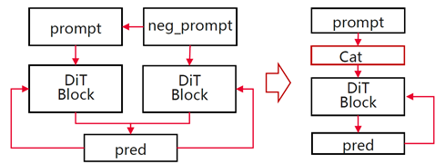

# Multi-Card Parallelism

<!-- md-trans-meta sourceCommit=unknown translatedAt=2026-06-05T08:14:57.532Z pushedAt=2026-06-08T08:04:14.093Z -->

MindIE SD provides multiple parallelism strategies to address the issues of insufficient single-card memory and inference speed bottlenecks. Different strategies split computation and memory from different dimensions:

- **Tensor Parallelism (TP)**: Splits weight matrices along rows or columns, distributing matrix computations across multiple cards. It is suitable for models with large hidden layer dimensions.

- **Ring Sequence Parallelism (RSP)**: Splits Q along the sequence dimension, transfers KV between devices using ring communication, and overlaps computation with communication overhead.

- **Ulysses Sequence Parallelism (USP)**: Splits inputs along the sequence dimension, rearranges them across attention heads via All-to-All, and computes different attention heads in parallel on each card.

- **Classifier-Free Guidance (CFG) Parallelism**: Distributes positive and negative sample inference across different devices for parallel execution. It is suitable for diffusion models using CFG.

Each strategy can be used independently or combined. For details on specific support, see [supported_matrix.md](supported_matrix.md).

**Recommended Solution:**

- **TP**: Can effectively reduce memory usage, but has high communication overhead and is not recommended as a priority.

- **USP**: Has low communication overhead and is recommended as a priority. Constraint: USP degree must be divisible by the number of attention heads in FlashAttention.

- **RSP**: Can be used alongside USP to handle cases where the parallelism degree is not divisible by the number of attention heads.

- **CFG Parallelism**: Has low communication overhead and is recommended when the model's CFG is greater than 1.

## TP

As model sizes grow, the memory capacity of a single card becomes insufficient for large models. TP distributes tensor computations (e.g., matrix multiplications, convolutions) across multiple devices and executes them in parallel, reducing per-device memory and computational load. This section uses matrix multiplication as an example to illustrate the principles of TP.

Given input data X of dimension \(b, s, h\) and parameters W of dimension \(h, h'\), a single matrix multiplication is illustrated below, where:

- b: batch size

- s: sequence length

- h: hidden size (dimension of each token vector)

- h': hidden size of parameter W.


The optimization methods are divided into the following two types:

- Row-wise split: Split along the rows of the weight matrix W. For N = 2, the matrix is divided along the dashed line as shown.

    

The figure below shows the result: the original matrix multiplication is transformed into two separate multiplications, each computed on a different NPU. The final result is obtained by summing the partial results via inter-chip communication.

    

- Column-wise split: Split along the columns of the weight matrix W. For N = 2, the matrix is divided as shown by the dashed lines.

    

The figure below illustrates the result: the original matrix multiplication is transformed into two separate multiplications, each executed on a different NPU. The partial outputs are then concatenated via inter-card communication to produce the final result.

    

### Code Example

The following example demonstrates the basic usage of distributed initialization and TP:

```python
import os
import torch
import torch.distributed as dist
import torch_npu

# 1. Initialize the distributed environment
dist.init_process_group(backend="hccl")
torch.npu.set_device(f"npu:{os.environ['LOCAL_RANK']}")

# 2. Define the original linear layer
linear = torch.nn.Linear(4096, 4096).npu()
x = torch.randn(1, 256, 4096, device="npu")

# 3. Split by column: each rank holds half of the columns of W
#    After the forward pass, results are merged via all-reduce communication
world_size = dist.get_world_size()
rank = dist.get_rank()

with torch.no_grad():
    # Split weights: each rank holds W[:, h//world_size * rank : h//world_size * (rank+1)]
    w_chunk = linear.weight.data.chunk(world_size, dim=0)[rank]
    # Local matrix multiplication
    local_out = x @ w_chunk.T
    # all-reduce merges results from all ranks
    dist.all_reduce(local_out)

print(f"Rank {rank} output shape: {local_out.shape}")
```

### Communication Method

For column-wise splitting, each device computes its local matrix multiplication independently, and the results are merged via all-reduce. For row-wise splitting, each device computes a shard of the full output, and the complete result is assembled using all-gather. Communication volume scales linearly with hidden_size. Given sufficient inter-device bandwidth, the communication overhead diminishes as the model size increases.

### Applicable Scenario

It is ideal for models with a large `hidden_size`, especially when a single card lacks sufficient memory for the full weight matrix. TP relies on high-bandwidth inter-device communication (e.g., HCCS) and is recommended only within a single node, with TP degree not exceeding the number of NPUs per node.

## RSP

### Principle

The sequence dimension `Q` is split across devices. During computation, each device processes its current KV pair, then sends the KV pair to the next device and receives the previous device's KV pair, forming a ring communication topology. When inter-card communication time ≤ computation time, communication overhead can be hidden by computation.


### Communication Method

Peers communicate via P2P. After completing the attention computation for the current step, device *i* sends its KV to device *i+1* and receives the new KV from device *i-1*. After *N* rounds of communication, all devices have computed attention for all sequence positions. When computation dominates communication (i.e., long sequences and large `head_dim`), the communication overhead is fully hidden.

### Applicable Scenarios

It is designed for long-sequence scenarios where the sequence length significantly exceeds `head_dim`. It performs best when P2P bandwidth between devices is sufficient (e.g., within the same NPU node). It is not suitable for short sequences, where communication overhead becomes disproportionately high.

### Usage Example

```python
import torch
import torch.distributed as dist

dist.init_process_group(backend="hccl")
rank = dist.get_rank()
world_size = dist.get_world_size()

batch, seqlen, head, dim = 1, 4096, 8, 128
seqlen_chunk = seqlen // world_size

# Each device holds its own Q/K/V shard
q_chunk = torch.randn(batch, seqlen_chunk, head, dim).npu()
k_chunk = torch.randn(batch, seqlen_chunk, head, dim).npu()
v_chunk = torch.randn(batch, seqlen_chunk, head, dim).npu()

def local_attn(q, k, v):
    score = (q @ k.transpose(-2, -1)) / (dim ** 0.5)
    return score.softmax(dim=-1) @ v

# First round: Compute its own KV
out = local_attn(q_chunk, k_chunk, v_chunk)

# Subsequent rounds: Pass KV in a ring
for step in range(1, world_size):
    send_rank = (rank + 1) % world_size
    recv_rank = (rank - 1 + world_size) % world_size
    k_recv = torch.empty_like(k_chunk)
    v_recv = torch.empty_like(v_chunk)
    dist.send_recv(k_chunk, k_recv, send=send_rank, recv=recv_rank)
    dist.send_recv(v_chunk, v_recv, send=send_rank, recv=recv_rank)
    k_chunk, v_chunk = k_recv, v_recv
    out += local_attn(q_chunk, k_chunk, v_chunk)
```

## USP

### Principle

Each sample is split along the sequence dimension and distributed across devices. Before attention computation, an All-to-All operation is applied to the partitioned Q, K, and V tensors, allowing each device to exchange information with all others and receive a non-overlapping subset of attention heads. Devices then compute different attention heads in parallel, followed by another All-to-All to gather the results.


### Communication Method

Core communication uses **All-to-All** collective operations. Before attention computation, each device shards its own sequence and sends the blocks to all other devices, while simultaneously receiving sequence blocks from others. Data is then reassembled along the attention head dimension. After computation, another All-to-All collects the results back along the sequence dimension. When sequence length and device count increase proportionally, per-device communication volume remains constant (see theoretical analysis in the DeepSpeed Ulysses paper).

### Applicable Scenario

It is well-suited for scenarios with a large number of attention heads and sufficient All-to-All bandwidth. Compared to RSP, USP is more efficient in short-sequence, multi-head settings—especially when both sequence length and hidden size are large.

- Example without USP:

    ```python
    import torch
    import torch_npu
    from mindiesd import attention_forward
    torch.npu.set_device(0)
    batch, seqlen, hiddensize = 1, 4096, 512
    head = 8
    x = torch.randn(batch, seqlen, hiddensize, dtype=torch.float16).npu()
    x = x.reshape(batch, seqlen, head, -1)
    out = attention_forward(x, x, x, opt_mode="manual", op_type="prompt_flash_attn", layout="BSND")
    x = out.reshape(batch, seqlen, hiddensize)
    ```

- Example with USP:

    ```python
    import os
    import torch
    import torch.distributed as dist
    import torch_npu
    from mindiesd import attention_forward

    batch, seqlen, hiddensize = 1, 4096, 512
    head = 8
    x = torch.randn(batch, seqlen, hiddensize, dtype=torch.float16).npu()

    def init_distributed(
        world_size: int = -1,
        rank: int = -1,
        distributed_init_method: str = "env://",
        local_rank: int = -1,
        backend: str = "hccl"
    ):
        dist.init_process_group(
            backend=backend,
            init_method=distributed_init_method,
            world_size=world_size,
            rank=rank,
        )
        torch.npu.set_device(f"npu:{os.environ['LOCAL_RANK']}")
    # 1. Initialize the distributed environment
    world_size = int(os.environ["WORLD_SIZE"])
    rank = int(os.environ["LOCAL_RANK"])
    init_distributed(world_size, rank)

    # 2. Split the seqlen dimension by world_size
    x = torch.chunk(x, world_size, dim=1)[rank] # Sequence splitting
    seqlen_chunk = x.shape[1]
    x = x.reshape(batch, seqlen_chunk, head, -1)

    # 3. Call all_to_all to enable USP
    in_list =  [t.contiguous() for t in torch.tensor_split(x, world_size, 2)]
    output_list = [torch.empty_like(in_list[0]) for _ in range(world_size)]
    dist.all_to_all(output_list, in_list)
    x = torch.cat(output_list, dim=1).contiguous()
    att_out = attention_forward(x, x, x, opt_mode="manual", op_type="prompt_flash_attn", layout="BSND")
    in_list =  [t.contiguous() for t in torch.tensor_split(att_out, world_size, 1)]
    output_list = [torch.empty_like(in_list[0]) for _ in range(world_size)]
    dist.all_to_all(output_list, in_list)
    x = torch.cat(output_list, dim=2).contiguous()
    x = x.reshape(batch, seqlen_chunk, hiddensize)

    # 4. Perform an all_gather operation on the seqlen dimension
    output_list = [torch.empty_like(x) for _ in range(world_size)]
    dist.all_gather(output_list, x)
    x = torch.cat(output_list, dim=1)
    ```

## CFG Parallel

### Principle

For a noisy image and a text prompt, the model needs to perform inference twice, computing the positive and negative samples respectively. This serial process doubles the forward passes per denoising step, increasing inference time. CFG Parallel eliminates this bottleneck by distributing the positive and negative computations across separate devices, effectively merging two serial passes into a single parallel step and substantially improving inference speed.


### Communication Method

Positive and negative samples are computed independently on each device with no intermediate communication. After computation, results are collected via all-gather, or each device directly uses its own local results. Communication overhead is negligible—effectively zero-cost parallelism.

### Applicable Scenario

It is designed for diffusion model inference with CFG (guidance_scale > 1) and requires at least 2 idle devices. More devices bring speedups approaching 2×. If devices are limited, prioritize resources for TP or SP.

### Usage Example

```python
import os
import torch
import torch.distributed as dist

dist.init_process_group(backend="hccl")
torch.npu.set_device(f"npu:{os.environ['LOCAL_RANK']}")

rank = dist.get_rank()
guidance_scale = 7.5

# Rank 0 computes the negative sample (unconditioned), and rank 1 computes the positive sample (conditioned).
if rank == 0:
    noise_pred_uncond = model(latent, timestep, uncond_embed)
    output = noise_pred_uncond
elif rank == 1:
    noise_pred_cond = model(latent, timestep, cond_embed)
    output = noise_pred_cond

# Exchange results via all-gather.
output_list = [torch.empty_like(output) for _ in range(world_size)]
dist.all_gather(output_list, output)

# CFG Fusion
noise_pred = output_list[0] + guidance_scale * (output_list[1] - output_list[0])
```

### Supplementary Content — CFG Fusion

CFG fusion is an alternative optimization: instead of parallelizing across devices, it concatenates positive and negative samples along the batch dimension within a single device. This allows one forward pass to produce both results, cutting operator calls in half.

Compared with CFG parallelism, CFG fusion does not consume additional device resources, making it suitable for scenarios with limited devices but a need to reduce per-inference latency. The two approaches can be selected based on hardware conditions.


