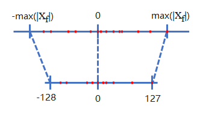

# Quantization

MindIE SD provides two types of quantization capabilities, applied to different parts of the model:

- **Linear Quantization**: Applies low-bit processing (INT8/FP8/W8A16, etc.) to linear layer weights and activations, reducing model storage and computation overhead.
- **FA Quantization**: Applies FP8 block quantization to Q/K/V activations in attention computation, reducing memory bandwidth requirements.

The following two sections describe the principles and usage of each quantization type.

## Linear Quantization

### General Principles

Quantization is the process of mapping model weights and activations from high precision (e.g., FP32) to low precision (e.g., INT8, FP8). Low-precision computation reduces memory usage and bandwidth requirements, improving inference throughput.

Based on whether retraining is needed, quantization is divided into Post-Training Quantization (PTQ) and Quantization-Aware Training (QAT). This section focuses on PTQ quantization, which falls into three main types:

- **Dynamic Quantization**: Only weights are quantized offline; activation quantization factors are dynamically computed during inference.
- **Static Quantization**: Both weights and activations are quantized offline.
- **Time-Aware Quantization**: Quantization strategy is dynamically adjusted based on the time dimension.

The following diagram shows an INT8 quantization example, mapping FP32 to INT8. `[-max(xf), max(xf)]` is the pre-quantization float range, and `[-128, 127]` is the post-quantization range.



### Technical Features

This repository handles Linear quantization uniformly through the `quantize` API, supporting the following algorithms.

**Weight Quantization** (only weights are quantized; activations remain at original precision):

| Algorithm | Weight Precision | Description |
| ------ | ---------- | ------ |
| W8A16 | INT8 | Basic weight quantization |
| W4A16 | INT4 | Higher compression ratio |
| W4A16_AWQ | INT4 + AWQ | Activation-aware weight quantization |
| W8A16_GPTQ | INT8 + GPTQ | GPTQ post-training weight quantization |
| W4A16_GPTQ | INT4 + GPTQ | Same as above, INT4 version |

**Weight-Activation Quantization** (both weights and activations are quantized; computation done in low precision):

| Algorithm | Quantization Granularity | Description |
| ------ | ---------- | ------ |
| W8A8 | Per-layer | Basic INT8 weight-activation quantization |
| W8A8_TIMESTEP | Per-layer + timestep | Dynamically switch quantization strategy during inference |
| W8A8_DYNAMIC | Per-layer | Dynamic activation quantization |
| W8A8_PER_CHANNEL | Per-channel | Channel-granularity quantization |
| W8A8_PER_TENSOR | Per-tensor | Tensor-granularity quantization |
| W8A8_MXFP8 | Per-layer | MXFP8 format quantization |
| W4A4_DYNAMIC | Per-token + per-channel | INT4 weight-activation quantization |
| W4A4_MXFP4_SVD | Per-layer | MXFP4 format quantization |
| W4A4_MXFP4_DUALSCALE | Per-layer | MXFP4 dual-scale quantization |
| W4A4_MXFP4_DYNAMIC | Per-token + per-channel | MXFP4 dynamic quantization |

### API and Usage

All Linear quantization algorithms are triggered uniformly through the `quantize` API.

```python
from mindiesd import quantize
```

#### Parameters

| Parameter | Type | Required | Default | Description |
| ------ | ------ | ------ | -------- | ------ |
| `model` | `nn.Module` | Yes | - | Initialized floating-point model |
| `quant_json_path` | `str` | Yes | - | Path to quantization descriptor JSON containing algorithm, layer configuration, etc. |

#### Usage Examples

Basic quantization:

```python
model = from_pretrain()
model = quantize(model, "quant_model_description_w8a16_0.json")
model.to("npu")
```

Timestep quantization:

```python
from mindiesd import TimestepManager

model = quantize(model, "quant_model_description_w8a8_timestep_0.json",
                 timestep_policy=TimestepPolicyConfig(...))

for i, t in enumerate(timesteps):
    TimestepManager.set_timestep_idx(i)
    ...
```

### Online Quantization

Online quantization is the easy-to-use path for quickly enabling dynamic MM/FA quantization. Offline quantization is the fine-grained path for msmodelslim calibration, per-layer tuning, and exported-weight control.

```python
from mindiesd import OnlineQuantConfig, TimestepManager, TimestepPolicyConfig, quantize
from mindiesd.quantization.mode import QuantAlgorithm

timestep_config = TimestepPolicyConfig()
timestep_config.register(range(0, 4), "W4A8", target="w4a4_linear")
timestep_config.register([0, 1], "FLOAT", target="fa")
timestep_config.register([2, 3, 4], "FP8", target="fa")

online_config = OnlineQuantConfig(
    quant_type=QuantAlgorithm.W4A4_MXFP4_DYNAMIC,
    fallback_layers={"transformer_blocks.{0,1}.*": QuantAlgorithm.W16A16},
    fa_layers=("transformer_blocks.*.attn", "*Attention"),
    fa_quant_type=QuantAlgorithm.MXFP4_DYNAMIC,
    timestep_config=timestep_config,
    mxfp4_scale_alg=2,
    mxfp4_dst_type_max=7.25,
)
model = quantize(model, online_config=online_config)
```

Both `fallback_layers` and `fa_layers` support offline-tool-style exact, wildcard, and brace matching. `fa_layers` can match module names or class names. The example uses `range` for MM W4A8 timestep fallback and lists for FA timestep fallback; FA timesteps not listed above keep the default MXFP4 strategy. Online FA generates `q_rot/k_rot` automatically, so no rotation file is required; if `head_dim` cannot be inferred for a matched module, quantization fails fast. MXFP4 C7 uses the same option names as offline quantization: set `mxfp4_scale_alg=2` and `mxfp4_dst_type_max=7.25`.

#### Quantized Weight File Naming

Quantized weights and descriptor files are exported by the msmodelslim tool with the following naming convention:

- Weight file: `quant_model_weight_{quant_algo.lower()}_{rank}.safetensors`
- Descriptor file: `quant_model_description_{quant_algo.lower()}_{rank}.json`

For single-card quantization, `rank` is 0. For multi-card parallelism, each rank corresponds to its respective number.

## FA Quantization

### General Principles

FA (Flash Attention) quantization applies low-bit processing to Q/K/V activations in attention computation. Quantizing Q/K/V to FP8 before feeding into attention computation kernels significantly reduces memory bandwidth requirements and improves inference throughput. Unlike weight quantization, FA quantization processes dynamically generated activations during inference and requires block-level dynamic quantization strategies to balance accuracy and acceleration.

### Technical Features

This repository provides FA quantization via the `FP8_DYNAMIC` algorithm, with a three-step processing flow:

**Rotate**

Apply pre-trained rotation matrices (`q_rot`, `k_rot`) to Q and K, dispersing outliers across dimensions to mitigate FP8 quantization sensitivity to outliers.

**Block Quantization**

Dynamically quantize rotated Q/K/V into FP8 (`float8_e4m3fn`) block by block. Q uses a block size of 128, K/V use a block size of 256, performed via the `npu_dynamic_block_quant` operator.

**FP8 Attention**

Invoke MindIE-SD's own `torch.ops.mindiesd.fused_infer_attention_score_v2`
operator, which routes to the migrated `FusedInferAttentionScore` implementation
in this repository, to perform attention computation in the FP8 domain with
outputs dequantized back to original precision.

### API Reference

FA quantization is triggered uniformly through the `quantize` API; no separate FA quantization API call is needed.

```python
from mindiesd import quantize
```

#### Usage Example

```python
from mindiesd import quantize

# Load original floating-point model
model = from_pretrain()

# Execute quantization conversion (automatically identifies Attention layers and injects FA quantization)
model = quantize(model, "path/to/exported/quantization/config")

# Move model to NPU and run inference
model.to("npu")
```

`quantize` internally traverses model layers, automatically calling `add_fa_quant` on matching Attention layers, injecting `FP8RotateQuantFA` modules, and replacing the forward computation with the rotate -> block quantize -> FP8 Attention flow.

FA quantization layers are implemented through the `FP8RotateQuantFA` module. See the rotate -> block quantize -> FP8 Attention flow description in this section.

#### Notes

- Hardware requirement: Only Atlas 800I A2 inference servers support this feature.
- Q/K/V input layout supports both `BNSD` and `BSND`.
- FA quantization weights (`q_rot`, `k_rot`) must be pre-exported using the msmodelslim model compression tool. See the msmodelslim tool documentation for details.
