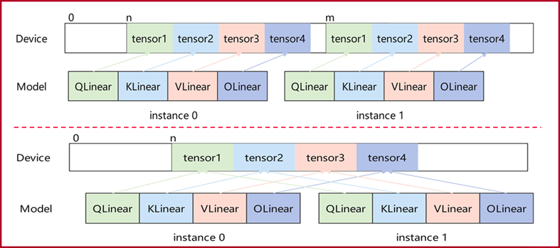
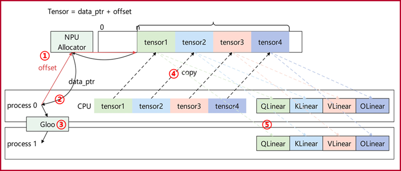

# Video Memory Sharing

<!-- md-trans-meta sourceCommit=unknown translatedAt=2026-06-05T08:15:21.665Z pushedAt=2026-06-08T08:42:47.167Z -->

- **Core Problem**

In multi-instance scenarios where multiple models on the same NPU device use identical weights (as shown below), enabling memory sharing can reduce consumption.

    

- **Theoretical Basis**

Using the same NPU physical address and offset, different tensors can be constructed to concurrently access the same memory region.

- **Design Approach**

Use an inter-process shared memory manager to allocate memory that can be accessed and shared across different processes.

- **Implementation Process**

    

  1. Process 0 calculates the required memory size offset and requests memory through the inter-process shared NPU Allocator.

  2. The NPU Allocator returns the allocated physical address `data_ptr` to Process 0.

  3. Process 0 transmits the actual physical address `data_ptr` to Process 1 via inter-process communication.

  4. Process 0 initiates a memory copy from CPU memory to the actual NPU physical address.

  5. Process 0 and Process 1 construct tensors using the physical address `data_ptr` and offset.

## API Description

```python
from mindiesd.share_memory import init_share_memory, share_memory
```

### `init_share_memory`

Initializes the inter-process shared memory manager.

```python
init_share_memory(instance_world_size, instance_id, master_addr="127.0.0.1", base_port=5555)
```

| Parameter | Type | Required (Yes/No) | Default Value | Description |
|------|------|------|--------|------|
| `instance_world_size` | `int` | Yes | - | Total number of instances |
| `instance_id` | `int` | Yes | - | Current instance ID (`0` is the primary instance) |
| `master_addr` | `str` | No | `"127.0.0.1"` | Primary address for the ZMQ communication  |
| `base_port` | `int` | No | `5555` | ZMQ base port |

### `share_memory`

Migrate the model to shared NPU device memory.

```python
share_memory(module, device=None, dtype=None)
```

| Parameter | Type | Required (Yes/No) | Default Value | Description |
|------|------|------|--------|------|
| `module` | `torch.nn.Module` | Yes | - | The model instance to be migrated |
| `device` | `str` / `torch.device` | No | `None` | Target device, e.g., `"npu:0"` |
| `dtype` | `torch.dtype` | No | `None` | Target data type |

### Usage Example

Primary instance (weight loading and sharing):

```python
from mindiesd.share_memory import init_share_memory, share_memory

init_share_memory(instance_world_size=2, instance_id=0)
model = ModelClass().to("npu")
model = share_memory(model, device="npu:0")
```

Secondary instance (shared memory receiving):

```python
from mindiesd.share_memory import init_share_memory, share_memory

init_share_memory(instance_world_size=2, instance_id=1)
model = ModelClass()  # Do Not Load Weights
model = share_memory(model, device="npu:0")  # Construct Tensor via Shared Handle
```

The primary instance broadcasts the NPU physical address of the weights to secondary instance via ZMQ. Secondary instance then construct tensors using the same physical address, enabling multi‑process sharing of the same graphics memory.
