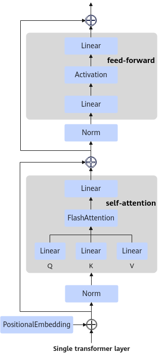

# 加速API

## 概述

MindIE SD在layer层主要优化接口包括RoPE、Norm、Linear、activation和attention，这些接口在Transformer结构中的位置如下图所示，可使能软件栈中的优化接口对原始计算进行替换。

**图 1**  Transformer结构图



## RoPE

- 原始代码：

    ```python
    class Attention(nn.Module):
        def __init__(self, xxx):
            # 省略
        def forward(self, hidden_states, freqs_cis_img):
            # 省略
            # 对query进行旋转位置编码处理，apply_rotary_emb为原始代码中的方法
            query = apply_rotary_emb(query, freqs_cis_img)
    ```

- 调用[def rotary_position_embedding](../appendix/api_reference.md#def-rotary_position_embedding)优化后的代码：

    ```python
    from mindiesd import rotary_position_embedding

    class Attention(nn.Module):
        def __init__(self, xxx):
            # 省略
        def forward(self, hidden_states, freqs_cis_img):
            # 省略
            cos, sin = freqs_cis_img
            cos, sin = cos.to(x.device), sin.to(x.device)
            query = rotary_position_embedding(query, cos, sin, rotated_mode="rotated_half", head_first=False, fused=True)
            key = rotary_position_embedding(key, cos, sin, rotated_mode="rotated_half", head_first=False, fused=True)
    ```

## Norm

- 原始代码：

    ```python
    norm_q = RMSNorm(dim_head, eps=eps)
    query = norm_q(query)
    ```

- 调用[class RMSNorm](../appendix/api_reference.md#class-rmsnorm)优化后的代码：

    ```python
    from mindiesd import RMSNorm
    norm_q = RMSNorm(dim_head, eps=eps)
    query = norm_q(query)
    ```

## Linear

- 原始代码：

    ```python
    qkv = nn.Linear(dim, dim * 3, bias=qkv_bias)
    qkv = qkv(x)
    ```

- 调用[class Linear](../appendix/api_reference.md#class-linear)优化后的代码：

    ```python
    from mindiesd import Linear
    qkv = Linear(dim, dim * 3, bias=qkv_bias, op_type="matmulv3")  # 初始化时新增op_type参数，值可选：{"matmulv3", "batchmatmulv3", "matmulv2", "batchmatmulv2"}。默认使用"matmulv2"
    qkv = qkv(x)
    ```

## activation

- 原始代码：

    ```python
    def get_activation_layer(act_type):
        if act_type == "gelu":
            return lambda: nn.GELU()
        elif act_type == "gelu_tanh":
            return lambda: nn.GELU(approximate="tanh")
        elif act_type == "relu":
            return nn.ReLU
        elif act_type == "silu":
            return nn.SiLU
        else:
            raise ValueError(f"Unknown activation type: {act_type}")
    act_func = get_activation_layer("silu")
    ```

- 调用[def get_activation_layer](../appendix/api_reference.md#def-get_activation_layer)优化后的代码：

    ```python
    from mindiesd import get_activation_layer
    act_func = get_activation_layer("silu")
    ```

## attention_forward

- 自torch.nn.functional.scaled_dot_product_attention迁移
    - 原始代码：

        ```python
        query = query.view(batch_size, -1, attn.heads, head_dim).transpose(1, 2)
        key = key.view(batch_size, -1, attn.heads, head_dim).transpose(1, 2)
        value = value.view(batch_size, -1, attn.heads, head_dim).transpose(1, 2)
        # the output of sdp = (batch, num_heads, seq_len, head_dim)
        hidden_states = F.scaled_dot_product_attention(
            query, key, value, attn_mask=attention_mask, dropout_p=0.0, is_causal=False
        )
        hidden_states = hidden_states.transpose(1, 2).reshape(batch_size, -1, attn.heads * head_dim)
        ```

    - 调用[def attention_forward](../appendix/api_reference.md#def-attention_forward)优化后的代码：

        ```python
        from mindiesd import attention_forward
        # q,k,v shape is batch, seq_len, num_heads, head_dim
        query = query.view(batch_size, -1, attn.heads, head_dim)
        key = key.view(batch_size, -1, attn.heads, head_dim)
        value = value.view(batch_size, -1, attn.heads, head_dim)
        # the input shape of attention_forward = (batch, seq_len, num_heads, head_dim)
        # the output of attention_forward = (batch, seq_len, num_heads, head_dim)
        hidden_states = attention_forward(query, key, value, attn_mask=attention_mask)
        hidden_states = hidden_states.reshape(batch_size, -1, attn.heads * head_dim)
        ```

- 自flash_attention.flash_attn_func迁移
    - 原始代码：

        ```python
        q = torch.randn(batch_size, seqlen_q, nheads, d, device=device, dtype=dtype)
        k = torch.randn(batch_size, seqlen_k, nheads, d, device=device, dtype=dtype)
        v = torch.randn(batch_size, seqlen_k, nheads, d, device=device, dtype=dtype)
        out = flash_attention.flash_attn_func(q, k, v)
        ```

    - 调用[def attention_forward](../appendix/api_reference.md#def-attention_forward)优化后的代码：

        ```python
        from mindiesd import attention_forward
        q = torch.randn(batch_size, seqlen_q, nheads, d, device=device, dtype=dtype)
        k = torch.randn(batch_size, seqlen_k, nheads, d, device=device, dtype=dtype)
        v = torch.randn(batch_size, seqlen_k, nheads, d, device=device, dtype=dtype)
        out = attention_forward(q, k, v)
        ```

    >[!NOTE]说明
    >
    >- 注意attention_forward接口的输入shape为(batch, seq_len, num_heads, head_dim)，输出shape为(batch, seq_len, num_heads, head_dim)。
    >- 由于attention_forward接口仅提供前向推理功能，不提供反向梯度计算，因此迁移时需要去掉dropout，并将输入tensor梯度设置为False。

## attention_forward_varlen

- 自flash_attn .flash_attn_varlen_func迁移，不使能causal时。
    - 原始代码：

        ```python
        out = flash_attn_varlen_func( q, k, v, cu_seqlens_q, cu_seqlens_k, max_seqlen_q, max_seqlen_k, dropout_p=0.0, softmax_scale=None, causal=False)
        ```

    - 调用[def attention_forward_varlen](../appendix/api_reference.md#def-attention_forward_varlen)优化后的代码：

        ```python
        from mindiesd import attention_forward_varlen
        out = attention_forward_varlen( q, k, v, cu_seqlens_q, cu_seqlens_k, dropout_p=0.0, softmax_scale=None, causal=False)
        ```

- 自flash_attn .flash_attn_varlen_func迁移，使能causal时。
    - 原始代码：

        ```python
        out = flash_attn_varlen_func( q, k, v, cu_seqlens_q, cu_seqlens_k, max_seqlen_q, max_seqlen_k, dropout_p=0.0, softmax_scale=None, causal=True)
        ```

    - 调用[def attention_forward_varlen](../appendix/api_reference.md#def-attention_forward_varlen)优化后的代码：

        ```python
        from mindiesd import attention_forward_varlen
        out = attention_forward_varlen( q, k, v, cu_seqlens_q, cu_seqlens_k, dropout_p=0.0, softmax_scale=None, causal=True)
        ```
