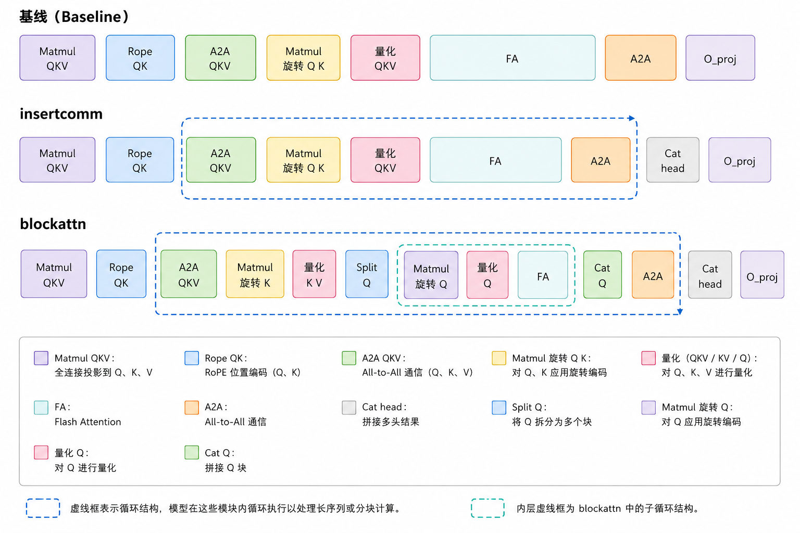

# FA_Power_Cap 技术

多模态视频生成的时长越来越长，分辨率越来越高，整体趋势往长时长的高清视频生成演进，序列长度可能达到兆级以上。随着多模态视频生成的时长越来越长，FA的耗时占比也会越来越大，AI处理器功耗也会随之上升。如果长序列负载所需的功耗超过PCIE板卡的TDP(Thermal Design Power)功耗上限，功耗保护机制PMC(Power Management Controller)可能触发降频从而降低功耗，将平均功耗控制在PCIE板卡的TDP功耗以内。本文面向长时长的高清视频生成，提供`FA_Power_Cap` 技术降低整网平均功耗，提升整网性能。

## 功能概述

`FA_Power_Cap` 技术通过将FA算子适当切分，并将FA执行前的通信插入到切分后的FA之间，撑大FA与FA的间隙，打断AI处理器的持续高密计算，让AI处理器计算一段时间，能稍微休息一下再继续执行高密计算，这种切分FA算子并重排FA与通信的执行顺序的技术能降低整网平均功耗，提升整网性能。

本文以Wan2.2模型为例，介绍如何使能`FA_Power_Cap` 技术。

面向已经能够运行 Wan2.2 模型仓的用户，本文介绍如何在一个未接入该特性的 Wan 仓中，手动加入 `FA_Power_Cap` 技术的 `insertcomm` 和 `blockattn` 两种单例优化。整个流程只新增一个统一入口：`--comm_type`。

`FA_Power_Cap` 技术面向 Wan Ulysses 序列并行，在单卡上对 attention 做进一步切分，并优化FA与通信的执行顺序。它保留 `attention_forward` 作为 FA 计算入口，不改变输出投影和整体 attention 语义，只调整 `A2A` 通信、RoPE/旋转编码、量化和 FA 计算在 head 分块或 Q 块循环中的执行位置。

如下图所示，baseline 保持原始的 QKV 投影、RoPE、`A2A QKV`、旋转/量化和 FA 路径；`insertcomm` 将 `A2A -> 旋转/量化 -> FA -> A2A` 放入按 attention head 切分的循环中；`blockattn` 在此基础上进一步拆分 Q，对每个 Q 块重复旋转、量化和 FA，再拼接 Q 块和 head 结果。代码接入时，只需要在 `attnlayer.py` 中通过 `comm_type` 在 baseline、`_run_insertcomm` 和 `_run_blockattn` 三条路径之间分发。

## 适用场景

`FA_Power_Cap` 技术只适用于已经开启 Ulysses 序列并行的 Wan 推理任务。也就是说，运行命令中需要有 `ulysses_size > 1`，并且模型的 attention head 数能够被 Ulysses 并行度整除。

三种模式在原理上呈递进关系，但实际使用时只能选择其中一个模式：

| 模式 | 参数 | 行为 |
| --- | --- | --- |
| Baseline | `--comm_type 0` | 保持原始基线路径：一次 `AlltoAll -> FA -> AlltoAll`。 |
| InsertComm | `--comm_type 1` | 单卡上先按 attention head 分块，再逐块执行 `AlltoAll -> FA`。 |
| BlockAttn | `--comm_type 2` | 单卡上先按 attention head 分块，再把本地 query sequence 固定切成 2 个 block 分别做 FA。 |

## 流水线示意图



图中对比了 baseline、插入通信和块级注意力三种路径。底部图例标明了输入处理、通信、矩阵乘法、量化、注意力计算、拼接和输出投影等阶段。

## 第一步：给 generate.py 增加 comm_type 参数

在 Wan 模型仓的 `generate.py` 中，找到 argparse 参数定义位置，增加：

```python
parser.add_argument(
    "--comm_type",
    type=int,
    default=0,
    choices=[0, 1, 2],
    help="FA_Power_Cap attention communication mode: 0 disables it, 1 enables insertcomm, 2 enables block attention.")
```

然后在参数校验处增加：

```python
if args.comm_type != 0 and args.ulysses_size <= 1:
    raise ValueError("comm_type optimization requires ulysses_size > 1.")
```

这样可以避免用户在单卡或未开启 Ulysses 时误开优化。

## 第二步：让 attention block 能读到 args

在创建 Wan transformer 后，把 `args` 挂到每个 block 上。普通模型和 FSDP 包装模型要分别处理：

```python
if args.dit_fsdp:
    for block in transformer._fsdp_wrapped_module.blocks:
        block._fsdp_wrapped_module.args = args
else:
    for block in transformer.blocks:
        block.args = args
```

如果 Wan2.2 使用 high-noise / low-noise 两个 transformer，需要两个模型都设置：

```python
for model in (transformer_high, transformer_low):
    if args.dit_fsdp:
        for block in model._fsdp_wrapped_module.blocks:
            block._fsdp_wrapped_module.args = args
    else:
        for block in model.blocks:
            block.args = args
```

## 第三步：在注意力层读取 comm_type

在 attention 类初始化时，从 block 传入的 `args` 读取通信模式：

```python
self.comm_type = int(getattr(self.args, "comm_type", 0))
```

后续分支统一写成：

```python
if self.fa_alltoall_overlap:
    ...
elif self.comm_type == 1:
    ...
elif self.comm_type == 2:
    ...
else:
    ...
```

## 第四步：实现 comm_type=1 的 insertcomm

`insertcomm` 的核心思想是先按 attention head 分块，避免一次性对完整 `Q`/`K`/`V` 做大规模 `AlltoAll`。

关键代码形态如下：

```python
_, _, hc, _ = query.shape
world_size = dist.get_world_size(group=self.ulysses_pg)
heads_per_npu = hc // world_size
loop_time = 10
heads_per_chunk = heads_per_npu // loop_time
global_chunk_size = heads_per_chunk * world_size

q_chunks = query.split(global_chunk_size, dim=2)
k_chunks = key.split(global_chunk_size, dim=2)
v_chunks = value.split(global_chunk_size, dim=2)
output_chunks = []

for chunk_id in range(loop_time):
    query = all_to_all_4D(q_chunks[chunk_id], scatter_idx=2, gather_idx=1, group=self.ulysses_pg)
    key = all_to_all_4D(k_chunks[chunk_id], scatter_idx=2, gather_idx=1, group=self.ulysses_pg)
    value = all_to_all_4D(v_chunks[chunk_id], scatter_idx=2, gather_idx=1, group=self.ulysses_pg)

    out = attention_forward(query, key, value, opt_mode="manual", op_type="fused_attn_score", layout="BNSD")
    output = all_to_all_4D(out, scatter_idx=1, gather_idx=2, group=self.ulysses_pg)
    output_chunks.append(output)

output = torch.cat(output_chunks, dim=2)
```

实际接入时，需要沿用原 attention 路径里的 ring、padding、RainFusion、FA 算子选择和量化分支。不要只复制上面的简化代码替换完整实现。

## 第五步：实现 comm_type=2 的 blockattn

`blockattn` 在 head 分块之后，再把本地 query sequence 固定切成 2 块。`K` 和 `V` 不切 sequence，两个 query block 都看完整 `K/V`。

关键代码形态如下：

```python
block_count = 2
query_blocks = torch.tensor_split(query_layer, block_count, dim=1)
block_outputs = []

for block_id in range(block_count):
    query_block = query_blocks[block_id]
    out = attention_forward(query_block, key_layer, value_layer, opt_mode="manual", op_type="fused_attn_score", layout="BNSD")
    block_outputs.append(out)

out = torch.cat(block_outputs, dim=1)
```

这里的 `block_count` 固定为 2，不再暴露额外参数。这样用户只需要选择 `--comm_type 2`，不用再理解额外拆分粒度。

## attnlayer.py 完整修改示例

下面示例展示了在 `attnlayer.py` 中把 baseline、`insertcomm` 和 `blockattn` 三条路径放到同一个 attention 类里的完整组织方式。实际迁移时，类名、`all_to_all_4D` 的 import 路径以及 attention 前后的投影、RoPE、padding、ring、RainFusion、量化分支需要按目标 Wan 仓的真实代码保留和合并。

```python
import torch
import torch.distributed as dist

from mindiesd import attention_forward
# from your_wan_sequence_parallel_module import all_to_all_4D


class FAPowerCapAttention:
    def __init__(self, args, ulysses_pg, fa_alltoall_overlap=False):
        self.args = args
        self.ulysses_pg = ulysses_pg
        self.fa_alltoall_overlap = fa_alltoall_overlap
        self.comm_type = int(getattr(self.args, "comm_type", 0))
        if self.comm_type not in (0, 1, 2):
            raise ValueError(f"comm_type must be 0, 1, or 2, but got {self.comm_type}.")

    def _attention_forward(self, query, key, value):
        return attention_forward(
            query,
            key,
            value,
            opt_mode="manual",
            op_type="fused_attn_score",
            layout="BNSD")

    def _run_baseline(self, query, key, value):
        query_layer = all_to_all_4D(query, scatter_idx=2, gather_idx=1, group=self.ulysses_pg)
        key_layer = all_to_all_4D(key, scatter_idx=2, gather_idx=1, group=self.ulysses_pg)
        value_layer = all_to_all_4D(value, scatter_idx=2, gather_idx=1, group=self.ulysses_pg)

        out = self._attention_forward(query_layer, key_layer, value_layer)
        return all_to_all_4D(out, scatter_idx=1, gather_idx=2, group=self.ulysses_pg)

    def _split_qkv_by_head(self, query, key, value):
        _, _, head_count, _ = query.shape
        world_size = dist.get_world_size(group=self.ulysses_pg)
        if head_count % world_size != 0:
            raise ValueError(
                f"head_count must be divisible by ulysses world size, "
                f"but got head_count={head_count}, world_size={world_size}.")

        heads_per_rank = head_count // world_size
        loop_time = 10
        if heads_per_rank % loop_time != 0:
            raise ValueError(
                f"heads_per_rank must be divisible by loop_time, "
                f"but got heads_per_rank={heads_per_rank}, loop_time={loop_time}.")

        global_chunk_heads = heads_per_rank // loop_time * world_size
        return (
            query.split(global_chunk_heads, dim=2),
            key.split(global_chunk_heads, dim=2),
            value.split(global_chunk_heads, dim=2),
        )

    def _run_insertcomm(self, query, key, value):
        q_chunks, k_chunks, v_chunks = self._split_qkv_by_head(query, key, value)
        output_chunks = []

        for q_chunk, k_chunk, v_chunk in zip(q_chunks, k_chunks, v_chunks):
            query_layer = all_to_all_4D(q_chunk, scatter_idx=2, gather_idx=1, group=self.ulysses_pg)
            key_layer = all_to_all_4D(k_chunk, scatter_idx=2, gather_idx=1, group=self.ulysses_pg)
            value_layer = all_to_all_4D(v_chunk, scatter_idx=2, gather_idx=1, group=self.ulysses_pg)

            out = self._attention_forward(query_layer, key_layer, value_layer)
            output = all_to_all_4D(out, scatter_idx=1, gather_idx=2, group=self.ulysses_pg)
            output_chunks.append(output)

        return torch.cat(output_chunks, dim=2)

    def _run_blockattn(self, query, key, value):
        q_chunks, k_chunks, v_chunks = self._split_qkv_by_head(query, key, value)
        output_chunks = []

        for q_chunk, k_chunk, v_chunk in zip(q_chunks, k_chunks, v_chunks):
            query_layer = all_to_all_4D(q_chunk, scatter_idx=2, gather_idx=1, group=self.ulysses_pg)
            key_layer = all_to_all_4D(k_chunk, scatter_idx=2, gather_idx=1, group=self.ulysses_pg)
            value_layer = all_to_all_4D(v_chunk, scatter_idx=2, gather_idx=1, group=self.ulysses_pg)

            block_outputs = []
            for query_block in torch.tensor_split(query_layer, 2, dim=1):
                block_outputs.append(self._attention_forward(query_block, key_layer, value_layer))

            out = torch.cat(block_outputs, dim=1)
            output = all_to_all_4D(out, scatter_idx=1, gather_idx=2, group=self.ulysses_pg)
            output_chunks.append(output)

        return torch.cat(output_chunks, dim=2)

    def forward(self, query, key, value):
        # 保留目标 Wan 仓中 forward 已有的 qkv projection、RoPE、norm、padding 等前置逻辑。
        if self.fa_alltoall_overlap:
            output = self._run_fa_alltoall_overlap(query, key, value)
        elif self.comm_type == 1:
            output = self._run_insertcomm(query, key, value)
        elif self.comm_type == 2:
            output = self._run_blockattn(query, key, value)
        else:
            output = self._run_baseline(query, key, value)

        # 保留目标 Wan 仓中 forward 已有的输出 reshape、O_proj、dropout 等后置逻辑。
        return output
```

接入时不要新建一个和原模型无关的 attention 类。更稳妥的做法是在原 `attnlayer.py` 的 attention 类里增加 `_run_insertcomm`、`_run_blockattn` 和 `_split_qkv_by_head` 这类辅助函数，再把原 forward 中的并行 attention 分支改成 `comm_type` 分发。

## 第六步：在脚本中传入 comm_type

脚本只保留一个变量：

```bash
COMM_TYPE=${COMM_TYPE:-0}
```

加一个简单校验：

```bash
case "${COMM_TYPE}" in
  0|1|2) ;;
  *) echo "COMM_TYPE must be 0, 1, or 2"; exit 1 ;;
esac
```

运行 `generate.py` 时传入：

```bash
torchrun --nproc_per_node=8 generate.py \
  --task t2v-14B \
  --ulysses_size 8 \
  --comm_type "${COMM_TYPE}"
```

脚本侧只需要保留 `COMM_TYPE` 这一个变量，并通过 `--comm_type` 传给 `generate.py`。

## 运行示例

Baseline：

```bash
COMM_TYPE=0 bash infer_t2v.sh
```

InsertComm：

```bash
COMM_TYPE=1 bash infer_t2v.sh
```

BlockAttn：

```bash
COMM_TYPE=2 bash infer_t2v.sh
```

## 验证与排查

- 确认 `ulysses_size > 1`，否则 `comm_type=1/2` 不应启用。
- 确认 attention head 数能被 `ulysses_size` 整除。
- 确认 attention 层的 `self.comm_type` 来自 `args.comm_type`。
- 确认命令行里出现 `--comm_type 0/1/2`。
- 用相同 prompt、seed、分辨率和步数分别跑三种模式，对比输出视频是否正常。
- 用耗时日志、MSPTI kernel 日志和 HCCL 日志观察 `AlltoAll` 与 FA 是否按预期被切分。

## 收益参考

以下数据来自 Wan2.2 客户蒸馏 Lite 模型场景，该模型仅需 `4 step`。测试配置为 `W16A16F8`、无 CFG、无 VAE 并行、`SP4`，端到端时间包含完整推理链路。本表仅统计 baseline 可正常完成的有效场景。

| 分辨率与帧数 | Baseline 时间 (s) | InsertComm 时间 (s) | InsertComm 收益 | BlockAttn 时间 (s) | BlockAttn 收益 | 说明 |
| --- | --- | --- | --- | --- | --- | --- |
| 720p161 帧 | 108.35 | 90.36 | 16.60% | 90.34 | 16.62% | baseline 正常完成，收益按 `(baseline - optimized) / baseline` 计算。 |
